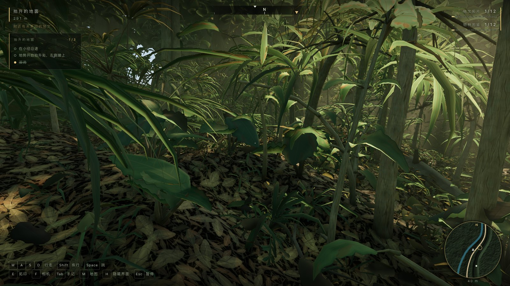
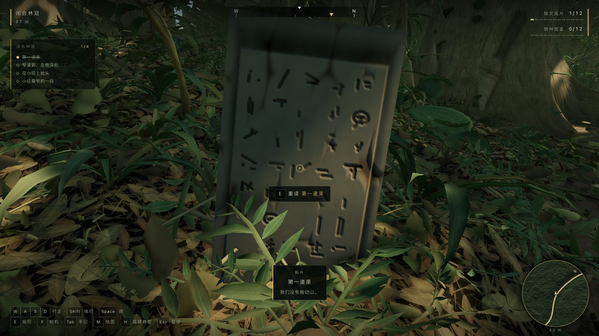
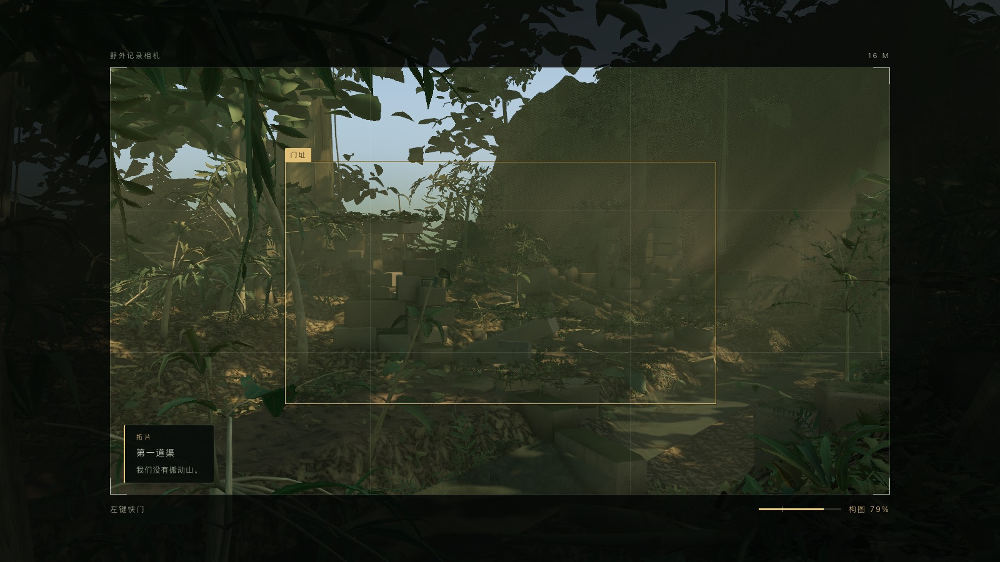
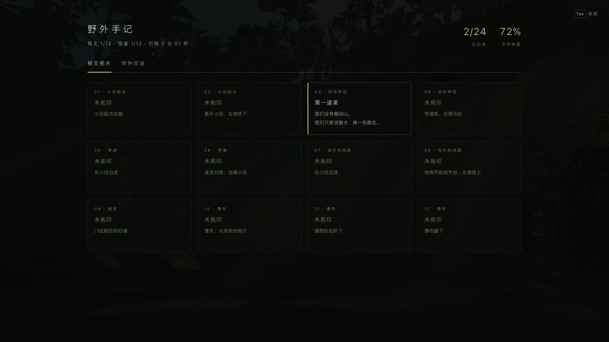

# OriginGame Trail

[Play on OriginGame](https://play.origingame.dev/yupadwblpc/)

Two first-person field walks built in Three.js with zero external art assets:
the original winding jungle trail into overgrown stone ruins and a waterfall,
and a timed rally stage on State Highway 8 along the turquoise shore of Lake Tekapo toward
the Southern Alps. Each is a small exploration game recorded through the same
field notebook.

Every texture, mesh and sound in the scene is generated procedurally in code.
There are no image files, no models, no audio recordings and no material
libraries: the leaf atlas, the bark, the ground, the stone, the inscription
script, the character's skin and all sixty audio buffers are computed at load
time.


## Running it locally

There is no build step. The page is plain ES modules with an importmap, so it
only needs a static file server.

```
git clone https://github.com/fran0220/origingame-trail.git
cd origingame-trail
npm run serve
```

Then open `http://localhost:8099/` and choose a scene. Deep links are
`#level=jungle` and `#level=lake`. Any other static server works equally well;
opening `index.html` from the filesystem does not, because ES modules and workers
need a real origin.

`npm install` is only needed for the tools in `tools/`, which use Playwright.
The game itself does not need it.

## Controls

| Input | Action |
|---|---|
| Click | Lock the pointer |
| Mouse | Look |
| W A S D | Move |
| Shift | Sprint |
| Space | Jump |
| E | Take a rubbing of the inscription you are standing at |
| F | Raise and lower the field camera |
| Left click (camera raised) | Shutter |
| Tab | Field notebook |
| M | Map: 40 m, 100 m, off |
| H | Hide the interface |
| Esc | Pause |

Add `#dev` to the URL to re-enable the number-key teleports along the trail.
They are off by default because skipping a stretch of trail skips the tablets
standing in it.


## The game

The Jungle notebook has twelve inscriptions and twelve photographs, neither on
the trail's critical path — the walk to the falls works exactly as it did
before. Lake Tekapo is driven rather than walked and is scored on the clock; it also has no artificial tablets, completing through twenty
photographs of native flora, fauna, the glacial shore and the Southern Alps.
The two runs share one versioned save envelope but retain independent progress.

**Inscriptions.** Twelve carved tablets stand along the route, six within a
couple of metres of the tread and six far enough off it that they can only be
found by leaving the path. Each holds one fragment of what the people who built
the temple wrote down; read in any order, they add up to why the place was
abandoned. The script on them is generated, not authored: each panel hashes to a
grid of chisel strokes and rings, carved into the same height field the stone's
weathering is built from, with an erosion mask running over the top so a tablet
loses whole phrases to one weathered patch rather than losing every stroke a
little.

**Photographs.** Raising the camera narrows the lens from 58° to 34°, slows the
head in proportion, and puts a frame on the world. A subject is accepted when it
is inside the frame, unobstructed, at a distance it reads at, and filling a
sensible part of the picture — measured against its own size, so a fern and a
waterfall are judged by the same rule. The shot that gets kept is the best one
you have taken; a worse retake costs nothing.

**The map.** Baked once from the terrain itself — hillshade and two-metre
contours off the same height field the ground is meshed from, the trail on its
own curve, and the pool, brook, spillway and swallow hole drawn from the
constants that built them rather than from a moisture field that would have put
a lake over the whole ruins clearing. It rotates with the player and marks only
records already taken; the one exception is the tablet the proximity sense has
already announced, which appears as an anonymous ring. A map that marked all
twelve would turn a game about looking into a game about walking between icons.



**Finding things.** Six of the twelve tablets are deliberately off the tread,
and with no feedback at all the only way to find those is to mow the
undergrowth. So the HUD carries a proximity sense: within about twenty metres of
a tablet you have not rubbed, a line appears saying something is near. It gives
a distance and nothing else — no bearing, no marker — so the player still has to
look. Each chapter also reports how many of its records you hold, and says so
the moment the last one lands, which is the difference between "I have finished
this stretch" and "I should walk it again to be sure".



**The sun.** Every second record moves the sun one step of twelve, from a high
morning to a low evening. This is the only reward in the game that changes the
whole picture and it costs nothing to author: the sky, the image-based lighting
and every shadow in the scene are already functions of one direction.

The run ends at the tablet at the foot of the falls, or when the notebook is
full — whichever comes first. Ending at the falls means the walk always has a
reachable ending; the notebook can still be finished afterwards.




## What is in it

- 22,220 lines of hand-written JavaScript across 46 modules in `src/`; the game
  layer is 10 of them.
- A 423.8 m trail across a 180 x 492 m world, from a 361 x 985 heightfield
  sampled every 0.5 m.
- 100,799 individual plants across 16 species, all built from two primitives: a
  bent leaf card and a swept tube.
- 536 individually eroded stone blocks. The ruin plan is computed before the
  terrain, so the ground builds a terrace and spoil banks beneath the temple
  rather than the temple being dropped onto whatever the ground happened to do.
- 12 inscription tablets set into the finished heightfield, each one mesh
  mapping into its own cell of a single 16-panel bake.
- A procedural character: 22 bones, 7,488 triangles, and a 512-square procedural
  body atlas.
- 15 GPU texture bakes producing 29 images, plus a sixteenth for the inscription
  panels. The leaf atlas is 2048-square; the bark, ground and inscription sets
  are 1024-square.
- 17 distinct synthesized voices and 60 audio buffers, baked in a worker on the
  first user gesture. Gameplay cues are synthesized live on the same graph
  rather than added to the bank.

## Performance

6.2 - 8.7 ms per frame on an RTX 4060 at 1600x900, at roughly 1,000 draw calls
and 5.8 - 6.6 M triangles. The game caps itself at 60 fps; there is no reason for
a walking-pace scene to render at 300. The game layer adds twelve draw calls and
twelve colliders and does not move either number.

## Techniques

**GPU texture baking.** Every texture is a GLSL `surf()` function rendered into a
render target. Normal maps are derived by Sobel-sampling the same function rather
than being authored separately, so the normal can never disagree with the albedo
it belongs to.

**Noise.** Perlin FBM and ridged Perlin, Ashima simplex in 2D and 3D, periodic
domain-wrapped Perlin taking a `vec2` period so a texture can tile at a different
rate on each axis, and Worley cellular noise.

**Sky and lighting.** Atmospheric scattering is baked to a cube and
PMREM-prefiltered, which means the sky you look at and the image-based lighting on
every surface are literally the same function evaluated twice, instead of a
skybox plus a separately tuned ambient term that drifts away from it.

**Canopy shadowing.** The canopy is not in the shadow map. It is replaced by an
analytic transmittance term, which is both cheaper and better behaved than trying
to resolve a hundred thousand leaf cards in a depth buffer.

**Volumetrics.** A half-resolution dithered raymarch for the light shafts.

**Audio.** The DSP is pure functions: `Float32Array` in, `Float32Array` out, with
no Web Audio anywhere in the synthesis path. Only `src/audio/engine.js` touches
the Web Audio API. That separation is what lets the exact same code render the
soundscape to WAV files offline in Node, which is how it gets measured.

The ambient beds loop at 9.31, 10.69, 11.73, 12.07, 13.37, 13.93, 14.91 and 16.41
seconds. Those lengths are mutually incommensurate, so the soundscape has no
common period and never audibly repeats.

**Occlusion for the camera.** Whether a subject is hidden is answered by a march
over the heightfield rather than a scene raycast. The terrain is the only thing
here that can hide a landmark completely — leaves cannot, which is why a scene
raycast would be wrong as well as expensive: a shot of the falls through a gap in
the canopy is a shot of the falls.


## Loading, saving and the platform

The game runs standalone with no account and no network. When it is deployed to
an [OriginGame](https://origingame.dev) server it also uses four platform
services, each of which degrades to the local behaviour if it is unavailable:

- **Loading protocol.** The world takes several seconds to build, so the build is
  staged and yields a frame between stages. Progress goes to the page's own
  loading bar and to the portal, and `ready()` is called at the first playable
  frame rather than at `window.load`.
- **Cloud save.** The notebook, the clock and the walker's exact position. The
  local copy is written first and unconditionally, so a flaky connection cannot
  cost a player an hour of walking. Photograph thumbnails stay in localStorage —
  twelve JPEGs would eat most of the 256 KB save budget.
- **Telemetry.** Chapter progression plus one event per record, carrying the
  position along the trail and how far off it the player was. That answers the
  question this content most needs answered: which tablets nobody ever finds.
- **Leaderboard.** Completion first, time only as a tie-break. A board sorted by
  time would reward running straight down a trail whose entire point is that you
  stop and look at it.

`src/game/platform.js` is the only file that knows any of this exists.



### Deploying

```
npm run deploy:check               # pack, then boot dist/ in a browser
node tools/cover-lake.mjs          # media/cover-lake.png, driven not posed
scripts/deploy.sh dist --update yupadwblpc --title "OriginGame Trail" \
  --engine threejs --genre racing --cover media/cover-lake.jpg \
  --license open --license-name MIT \
  --source-url https://github.com/fran0220/origingame-trail
```

`npm run deploy:check` is not optional. `pack.mjs` copies an allowlist and
prints a file count, which is not evidence: the allowlist was
`['index.html', 'src', 'vendor']` and Lake Tekapo's scanned ground and glTF
plants live under `media/lake-assets`, so the packed build was a level that
404s every texture it asks for — and it produced exactly the same cheerful
summary as a good one. The check serves `dist/` over HTTP, boots both levels in
a real browser from a fresh page each, and fails on any 404 or page error.

`--update yupadwblpc` matters too: without it a deploy creates a second game
rather than a new version of the one people already have a link to.

It is live at
[play.origingame.dev/yupadwblpc](https://play.origingame.dev/yupadwblpc/).

Three.js is vendored into `vendor/` rather than fetched from a CDN. The platform
turns a deployed game into an offline-capable PWA, and its service worker
deliberately does not cache cross-origin requests — so a CDN dependency would
make the offline promise false and add a cross-origin round trip to every cold
start.

## Tests

```
npm run serve &      # the tests drive a real page
npm test             # smoke + movement + full journey + save round-trip
npm run test:lake    # Lake habitat, shoreline and 20/20 photo reachability
npm run test:road    # The seal lies on its formation, and the grade is drivable
npm run test:drive   # The stage can be driven, and the clock agrees with the road
npm run test:picker  # picker, deep links and flush-before-navigation
npm run test:cold    # repeated fresh-context starts for both levels
npm run shots        # visual acceptance captures into media/game/
```

`tools/movement.mjs` exists because of a bug that survived the whole build: the
input basis was mirrored about the world Z axis, so W went where the camera was
looking only while the player faced along the trail's starting direction, and
went exactly wrong at ninety degrees to it. Every test up to that point either
walked the scripted trail or teleported, so none of them ever turned and walked.
It now checks each key against the rendered camera's own forward and right
vectors at eight headings, including the two the broken basis got right by
accident.

`tools/journey.mjs` is the one that matters: it collects all twenty-four records
through the real input path — window keydown for the rubbing key, a canvas
mousedown for the shutter — rather than calling the verbs directly, because half
of what can break is the wiring. It places the camera for each subject at the
distance the scorer itself considers ideal, so a failure means the content is
unreachable or the judging is wrong, not that the test guessed badly.

## A note on dependencies

`package.json` has zero runtime npm dependencies and the page now loads nothing
over the network at all: Three.js r170 is vendored into `vendor/`.

The zero-asset claim is a separate one, and it is intact. There is no
`TextureLoader`, `GLTFLoader`, `RGBELoader`, `AudioLoader`, `fetch`,
`XMLHttpRequest`, `new Image` or `createImageBitmap` anywhere in `src/`.

## How it was built

The original brief the renderer was built from is kept unedited in
[PROMPT.md](PROMPT.md).

Each rendering system was built and then reviewed by a separate critic that saw
only rendered screenshots and never the source. The critic scored photorealism
against real jungle photography, and the system was iterated until it passed.

Reviewing renders rather than code caught real bugs that reading the source would
not have:

- Tree trunks rendering black, from inverted quad winding.
- Dark outlines around every leaf, from a premultiplied-alpha bug in the texture
  baker.
- Volumetric light shafts standing vertically at sunset, because canopy distance
  was being measured straight up instead of along the sun ray.


## Status

Honest version: this is not finished.

- **In:** terrain, vegetation, lighting, ruins, character, audio, and the
  inscription / photograph loop.
- **Being iterated:** water. It has had three passes and is still the weakest
  system. A blind critic currently scores it 4/10.
- **Not done:** post-processing. No colour grading, no depth of field — which
  the field camera would benefit from more than anything else in the scene.

The vegetation and lighting critics signed off at 5/10 and 6/10 respectively, and
they signed off on diminishing returns rather than on perfection.


## Licence

MIT — free to use, modify, and distribute. See [LICENSE](LICENSE).
